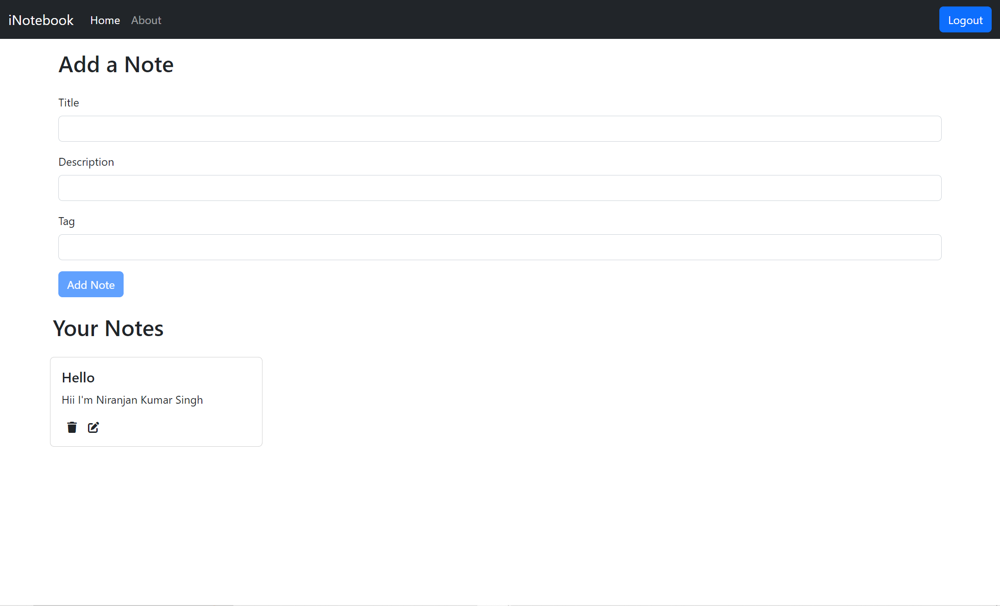

# NoteBook 📒


## Table of Contents
- [Introduction](#introduction)
- [Features](#features)
- [Demo](#demo)
  - [Live Link](#live-link)
  - [Screenshot](#screenshot)
  - [GIF Demo](#gif-demo)
- [Technologies Used](#technologies-used)
- [Installation](#installation)
  - [Prerequisites](#prerequisites)
  - [Steps](#steps)
- [Usage](#usage)
- [Contributing](#contributing)
- [Contact](#contact)

## Introduction

**NoteBook** is a web application that allows users to create, edit, and manage notes efficiently. Built with React, this app provides a simple and intuitive interface for users to organize their thoughts, ideas, and tasks. Whether you're jotting down important reminders or drafting longer notes, NoteBook helps keep your information accessible and organized.

## Features

- **Create and Edit Notes:** Easily add new notes or modify existing ones.
- **Delete Notes:** Remove notes that are no longer needed.
- **Responsive Design:** Optimized for use on desktops, tablets, and mobile devices.
- **User-Friendly Interface:** Simple navigation and layout for better user experience.
- **Local Storage:** Notes are saved in the browser's local storage for easy access.

## Demo

### Live Link

Check out the live version of the application [here](YOUR_LIVE_LINK_HERE).

### Screenshot



*Screenshot of the NoteBook application's homepage.*

### GIF Demo


*Animated demonstration of the NoteBook application.*

## Technologies Used

- **Frontend:** React, HTML, CSS
- **State Management:** React Hooks
- **Deployment:** Netlify or GitHub Pages *(if applicable)*

## Installation

### Prerequisites

- **Node.js** and **npm** installed on your machine.
- **Git** installed on your machine.

### Steps

1. **Clone the Repository**

   ```bash
   git clone https://github.com/Niranjan-Kumar-Singh/NoteBook_ReactJS.git
   ```

2. **Navigate to the Project Directory**

   ```bash
   cd NoteBook_ReactJS
   ```

3. **Install Dependencies**

   ```bash
   npm install
   ```

4. **Run the Application**

   ```bash
   npm run both
   ```

   The application will run on `http://localhost:3000`.

## Usage

1. **Create a New Note**

   - Click on the "Add Note" button to create a new note.
   - Enter your text and save.

2. **Edit an Existing Note**

   - Click on the note you want to edit.
   - Make your changes and save.

3. **Delete a Note**

   - Click on the delete icon next to the note you wish to remove.

4. **Responsive Design**

   - Access the application from any device, and it will adjust its layout accordingly.

## Contributing

Contributions are welcome! Follow these steps to contribute:

1. **Fork the Repository**

2. **Create a New Branch**

   ```bash
   git checkout -b feature/YourFeatureName
   ```

3. **Make Your Changes**

4. **Commit Your Changes**

   ```bash
   git commit -m "Add some feature"
   ```

5. **Push to the Branch**

   ```bash
   git push origin feature/YourFeatureName
   ```

6. **Open a Pull Request**

Please ensure your code follows the project's coding standards and includes relevant tests.

## Contact

- **Niranjan Kumar Singh**
- **Email:** [niranjansingh1419@gmail.com](mailto:niranjansingh1419@gmail.com)
- **GitHub:** [Niranjan-Kumar-Singh](https://github.com/Niranjan-Kumar-Singh)
- **LinkedIn:** [Niranjan-Kumar-Singh](https://www.linkedin.com/in/niranjan-kumar-singh/)
